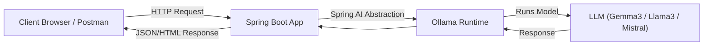

# Ollama + Spring AI Integration

This guide explains how to run **Ollama** locally and integrate it with **Spring AI** to interact with LLMs programmatically.

---

## 📌 Overview

Ollama is a lightweight runtime that allows you to run Large Language Models (LLMs) such as **Gemma**, **Llama 3**, **Mistral**, and others locally.

> 📝 **Analogy:**
> What **Docker** is for containers, **Ollama** is for LLM models.
> It allows you to **pull**, **run**, and **manage** models on your machine in a standardized way.

Spring AI provides a simple, idiomatic way to connect to Ollama and send prompts from your Spring Boot application.

---

## 🖼️ Architecture



---

## 🚀 Prerequisites

* **OS**: macOS, Linux, or Windows (via WSL recommended)
* **CPU/GPU**: Modern CPU (GPU recommended for large models)
* **Software**:

    * [Ollama](https://ollama.ai/download)
    * [Java 11+](https://adoptium.net/)
    * [Maven](https://maven.apache.org/)

---

## 🛠 Installation

### 1. Install Ollama

```bash
curl -fsSL https://ollama.ai/install.sh | sh
```

> On Windows, download the installer from [Ollama Download Page](https://ollama.ai/download).

### 2. Verify Installation

```bash
ollama --version
```

### 3. Pull a Model

```bash
ollama pull gemma3:1b
```

---

## 🧩 Spring Boot Setup

### 1. Add Maven Dependency

```xml
<dependency>
    <groupId>org.springframework.ai</groupId>
    <artifactId>spring-ai-starter-model-ollama</artifactId>
</dependency>
```

---

### 2. Configure `application.properties`

```properties
spring.application.name=spring-ai-demo

spring.ai.ollama.base-url=http://localhost:11434
spring.ai.ollama.chat.model=gemma3:1b
```

---

### 3. Create a Service Class

```java
package com.example.spring.ai;

import org.springframework.ai.chat.client.ChatClient;
import org.springframework.stereotype.Service;

@Service
public class SpringAI {

    private final ChatClient chatClient;

    public SpringAI(ChatClient.Builder builder) {
        this.chatClient = builder.build();
    }

    public String tellMeAJoke() {
        return chatClient.prompt()
                         .user("Tell me a joke in hindi")
                         .call()
                         .content();
    }
}
```

---

### 4. Use the Service in a Controller

(Optional but recommended for testing)

```java
package com.example.spring.ai;

import org.springframework.web.bind.annotation.GetMapping;
import org.springframework.web.bind.annotation.RestController;

@RestController
public class AIController {

    private final SpringAI springAI;

    public AIController(SpringAI springAI) {
        this.springAI = springAI;
    }

    @GetMapping("/joke")
    public String getJoke() {
        return springAI.tellMeAJoke();
    }
}
```

---

### 5. Run the Application

```bash
./mvnw spring-boot:run
```

Then visit:
➡️ **[http://localhost:8080/joke](http://localhost:8080/joke)**
You should see a joke generated by the `gemma3:1b` model.

---

## 🌐 Testing via REST API (Optional)

If you want to test Ollama directly before using Spring AI:

```bash
curl http://localhost:11434/api/generate -d '{
  "model": "gemma3:1b",
  "prompt": "Tell me a joke in hindi"
}'
```

---

## 📚 Useful Commands

| Command               | Description            |
| --------------------- | ---------------------- |
| `ollama pull <model>` | Download a model       |
| `ollama run <model>`  | Start interactive chat |
| `ollama list`         | List installed models  |
| `ollama ps`           | Show running models    |

---


---

## 📦 Spring AI Model Starters

Spring AI provides **starter dependencies** for different model providers (Ollama, OpenAI, Anthropic, Vertex AI, etc.).
These starters bring the correct configuration and clients into your Spring Boot project with minimal setup.

> 📝 **Definition:**
> `spring-ai-starter-model-<provider>` is a **modular dependency** that lets you switch between different LLM providers by just changing the `<provider>` name.
> It works like a plug-and-play adapter for various LLM backends.

---

### 🔧 Generic Maven Dependency Syntax

```xml
<dependency>
    <groupId>org.springframework.ai</groupId>
    <artifactId>spring-ai-starter-model-<provider></artifactId>
</dependency>
```

Where `<provider>` can be:

| Provider Name      | Artifact Example                           | Use Case                           |
| ------------------ | ------------------------------------------ | ---------------------------------- |
| `ollama`           | `spring-ai-starter-model-ollama`           | Run local LLMs via Ollama runtime  |
| `openai`           | `spring-ai-starter-model-openai`           | Connect to OpenAI GPT models       |
| `azure-openai`     | `spring-ai-starter-model-azure-openai`     | Use Azure-hosted OpenAI models     |
| `anthropic`        | `spring-ai-starter-model-anthropic`        | Connect to Claude models           |
| `vertex-ai-gemini` | `spring-ai-starter-model-vertex-ai-gemini` | Use Google Vertex AI Gemini models |

---

✅ **Example:**

For Ollama:

```xml
<dependency>
    <groupId>org.springframework.ai</groupId>
    <artifactId>spring-ai-starter-model-ollama</artifactId>
</dependency>
```

For Anthropic claude:

```xml
<dependency>
    <groupId>org.springframework.ai</groupId>
    <artifactId>spring-ai-starter-model-anthropic</artifactId>
</dependency>
```

---


## ⚠️ Troubleshooting

* **Port in use** → Change Ollama port using:

  ```bash
  OLLAMA_HOST=127.0.0.1:11500 ollama serve
  ```
* **Model not found** → Run `ollama pull <model>` first
* **Slow response** → Use a smaller model like `gemma3:1b` or ensure GPU is available

